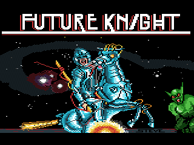
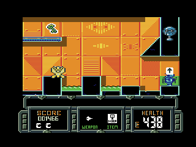
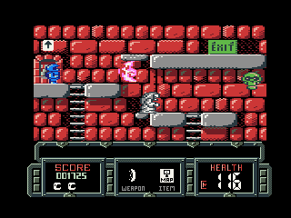
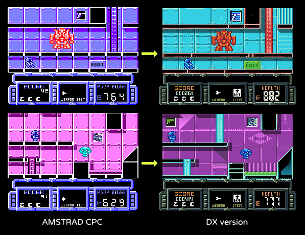

# Future Knight DX (2020)

​	Future Knight DX is a fan remake of the original 1986 game "Future Knight" by Gremlin Graphics Software who according to [Wikipedia](https://en.wikipedia.org/wiki/Gremlin_Interactive) is now defunct. I am guessing the game is now considered abandonware.

​	This is the source code of the game. I made this using [HaxeFlixel](https://haxeflixel.com/), and [Haxe](https://haxe.org). I tried to make the code readable and put comments explaining what I am doing. I hope this will be a decent example on how to approach some game related things, like enemy AI, player physics, loading and handling map data, etc.

## About the original Game

​	Future Knight was released in 1986 for some of the 8bit computers. It is a flip screen action platformer, find your way through the levels, collect items, kill or avoid enemies. The final goal of the game, according to the ZX Spectrum box is to *"Rescue your beloved maiden from the clutches of Spegbott the Terrible"* -- meaning your girlfriend crashed her ship on an alien planet and got abducted by an alien or something. Yes the story is cliché bad. But it is not the main focus.

​	The game had three distinct versions. The Amstrad CPC and Spectrum/MSX version shared the same gameplay mechanics and level design, they only had different graphics. The Commodore64 version shared the same graphics as the Amstrad CPC, but it had different gameplay and level design.

   
Gameplay gifs from the DX version

## Motivation, Story

​	Future Knight for the Amstrad CPC is one of the first video games I ever played and while I never finished it, I grew fond of it. This is the second time I am making this remake project.

​	Some years ago I made and published "[Future Knight Remake](https://john0032.itch.io/futurek)". Starting it off with the desire to do a faithful recreation, but because of reasons, it didn't turn out to be a 1:1 remake but rather a new game using the assets and mechanics of the original. Mostly did it as a programming practice, and in the end I was not completely happy with it.

​	Now, I decided to give this another go, and make a 1:1 recreation staying faithful to the original, keeping the same level design, enemies and gameplay beats. Only updating things that make sense and that enhance the experience. The overall updates in audio, visual and gameplay are mild. This is why the **DX** in the title. I took the idea from some of the Gameboy Color games that were re-releases with updated graphics *(Tetris DX, R-Type DX)*

## How is this different

#### Major Changes

- Added a basic **intro scene**. Shows the SOS message the hero receives (*it was written on the cassette inlay*). It is a minimum story to kickstart the adventure.
- **Changed the sprite** of Princess Amelia to something more modern. It is now a character wearing a spacesuit, like you do. In the original version she was just wearing a dress.
- **Changed the ending scene**. It used to be that you meet the princess, remove your helmet and kiss. None of that now, the ending scene is the two of you running away as the credits roll.
- **Save System**, the game will save at every exit you go through. You can resume the game from the main menu. The original game didn't feature a save system.
- **Inventory System**, you now have an inventory and you can collect the items you pickup, it used to be that you could only hold one item at a time.
- Added a **Map Item** for the spaceship area that will show you the layout of the levels.

#### Audio / Visual

- It is based on the Amstrad CPC version, meaning sprites and some audios are ripped from there. Yes everything is double wide pixels, except the HUD and Menus. Just like the original.
- Backgrounds and sprites have been recolored , using a softer palette [CPC BOY](https://lospec.com/palette-list/cpc-boy)
- The background and foreground tiles are slightly altered to add some visual interest.
- Added some new sound effects on top of the original ones.
- Added new music tracks that play in levels >> TODO >>>>>>>>>>>>>>>

  
Old and new graphics comparison. Nothing too exteme, just a slight upgrade.

#### Gameplay Changes

- The overall game speed is increased. You move more quickly now and the enemies too. It was way too slow on the Amstrad CPC
- You will now jump higher the longer you press the button and you can slightly adjust your direction in mid-air.
- You can mount ladders from mid-air, also you can drop from ladders.
- Locked exits are now colored red.
- To unlock an exit you must now have the item required equipped when you try to activate it. It used to be that you can use the unlocking item anywhere on the map
- Changed the second weapon behavior. It is now a rapid fire weapon that deals less damage.
- Very minor tweaks in a couple of places, replacing solid platforms with soft platforms, making way for shortcuts.
- One major addition of stairs in a room at the spaceship. Makes it more player friendly, when you go down all the way, but don't have a key to unlock the door. You can come back up quicker.
- Some slight changes to the layout of some areas that required an item to make progress. The usage of those special key items can only happen at the designated "*special event*" objects.
  - In the spaceship you could drop down in a pit and if you did not have the platform key, you would get stuck there. Now you must have the platform key in order for a ladder to appear and drop down/climb up.
  - In the forest, there was a part that required a "bridge spell" to create a platform and continue on, but you could easily just not do that, and run over the toxic waters. Now there is an obstacle that blocks your path, and you have to use the item to continue on.
- New sprite and behavior for the final boss, He will now move around and shoot. You are now locked into the room until you defeat him. He has three phases and you must use the "destruct spell" at a point. It used to be that he was immobile and you could just pass right through him to the other room.
- Using Bombs will now kill the enemies on the screen forever, meaning they will not respawn even after leaving and re-entering the room.

## THE CODE

## BUILDING

- Haxe 4.2.0
- HaxeFlixel 4.11.0
- djFlixel 0.5
