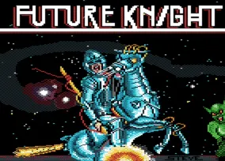
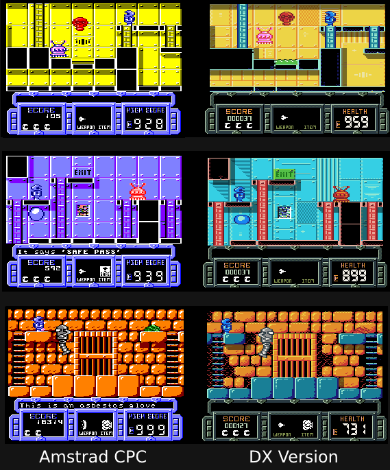

# Future Knight DX (2022)

​**Future Knight DX** is a fan remake of the 1986 game "*Future Knight*" by Gremlin Graphics Software. It is based on the Amstrad CPC version, it tries to stay faithful to the original, keeping the same level design, enemies and gameplay beats; while only updating things that make sense and that enhance the experience. The graphics are slightly updated, and the same for the sounds. This is why the **DX** in the title. I took the idea from some of the Game Boy Color games that were re-releases with small updates to the originals like *Tetris DX and R-Type DX*.

​This repo is the source code of the game along with all the assets that are needed to compile. Made with [HaxeFlixel](https://haxeflixel.com/), and [Haxe](https://haxe.org). The code is commented throughout (*mostly*) and I think it can provide a decent example on how to approach some game related things, like enemy AI, player physics, spawning and handling entities on a map, etc. Plus another practical example on using my library [djFlixel](https://github.com/john32b/djFlixel) (*which mostly provides a Menu Object*)

**Visit the GAME PAGE here** :  <https://john0032.itch.io/future-knight-dx>

- play online HTML5 (desktop)
- download for Windows
- download for Linux

---

## About the original Game

Future Knight was released in 1986 for the 8bit computers *Amstrad CPC, ZX Spectrum, Commodore 64 and MSX*. It is a flip screen action adventure platformer where you need find your way through the levels while collect items and killing/avoid enemies. The final goal of the game, according to the ZX Spectrum box is to *"Rescue your beloved maiden from the clutches of Spegbott the Terrible"* -- meaning your girlfriend crashed her ship on an alien planet and got abducted by an evil aliens or something. Yes the story is cliché bad. But it is not the main focus.

The game had three distinct versions. The Amstrad CPC and Spectrum/MSX versions shared the same gameplay mechanics and level design, they only had different graphics. The Commodore64 version shared the same graphics as the Amstrad CPC, but it had different gameplay mechanics and level design than the others.

## Motivation

​Future Knight for the Amstrad CPC is one of the first video games I ever played and while I never finished it, I grew fond of it. This is the second time I am making this remake project.

​Some years ago I made and published "[Future Knight Remake](https://john0032.itch.io/futurek)". Starting it off with the desire to do a faithful recreation, but because of reasons... it didn't turn out to be a "*remake*" per se, but rather a new game using the assets and mechanics of the original, and in the end I was not completely happy with it. ​Now, I decided to give this another go, and make a true 1:1 remake.

---

## DX Version over Original

### Major Changes

- **Save System**, the game will save at every exit you go through. You can resume the game from the main menu. The original game didn't feature a save system.
- **Inventory System**, you now have an inventory and you can collect the items you pickup, it used to be that you could only hold one item at a time.
- Added a **Map Item** for the spaceship area that will show you the layout of the levels.
- Added a basic **intro scene**. Shows the SOS message the hero receives about the princess being captured and needing help. It is just a basic story to kick-start the adventure. (*The message was written on the cassette inlay of the ZX Spectrum Version*)
- **Changed the sprite** of Princess Amelia to something more modern. It is now a character wearing a spacesuit, like you do. In the original version she was just wearing a dress.
- **Changed the ending scene**. It used to be that you meet the princess, remove your helmet and kiss. None of that now, the ending scene is the two of you running away as the credits roll.

### Gameplay Changes

- The overall game speed is increased. You move more quickly now and the enemies too. It was way too slow on the Amstrad CPC
- You will now jump higher the longer you press the button and you can slightly adjust your direction in mid-air.
- You can mount ladders from mid-air, also you can drop from ladders.
- Locked exits are now colored red.
- To unlock an exit you must now have the item required equipped when you try to activate it. It used to be that you can use the unlocking item anywhere on the map
- Changed the second weapon behavior. It is now a rapid fire weapon that deals less damage, but the DPS remains almost the same.
- Very minor tweaks in a couple of places, replacing solid platforms with soft platforms, making way for shortcuts.
- Some slight changes to the layout of some areas that required an item to make progress. The usage of those special key items can only happen at the designated "*special event*" objects.
  - In the spaceship you could drop down in a pit and if you did not have the platform key, you would get stuck there. Now you must have the platform key in order for a ladder to appear and drop down/climb up.
  - In the forest, there was a part that required a "bridge spell" to create a platform and continue on, but you could easily just not do that, and run over the toxic waters. Now there is an obstacle that blocks your path, and you have to use the item to continue on.
- New sprite and behavior for the final boss, He will now move around and shoot. You are now locked into the room until you defeat him. He has three phases and you must use the "destruct spell" at a point. It used to be that he was immobile and you could just pass right through him to the other room.
- Using Bombs will now kill the enemies on the screen forever, meaning they will not re-spawn even after leaving and re-entering the room.
- Bombs no longer restore your health. It used to be that using a bomb you would get your full health back. But now you are more nimble and you don't have to backtrack that much, it would make the game too forgiving/easy.

### Audio / Visual

- It is based on the Amstrad CPC version, meaning sprites and some audios are ripped from there. Yes everything is double wide pixels, except the HUD and Menus. Just like the original.
- Backgrounds and sprites have been recolored , using a softer palette [CPC BOY](https://lospec.com/palette-list/cpc-boy)
- The background and foreground tiles are slightly altered to add some visual interest.
- Added some new **sound effects** on top of the original ones.
- Added **music** for each for the three level types and the final boss. The original game only featured one music track and in gameplay it would be silent. Only the C64 version played that one track during the whole game. Other versions played music only for the main menu only. *(The original music track from the Amstrad CPC is kept and plays at the main menu)*

---

## Building

To build **Future Knight DX** you will need

- Haxe 4.3.3 -- <https://haxe.org/>
- HaxeFlixel 5.5.0 -- <https://github.com/HaxeFlixel/flixel>
- djFlixel v0.5.9 -- <https://github.com/john32b/djFlixel>
- djA v0.2 -- <https://github.com/john32b/djA>
- openfl 9.3.2 - `haxelib install openfl 9.3.2`
- lime 8.1.1 - `haxelib install lime 8.1.1`

Supports building to `windows`, `hashlink`, `html5`, `flash`  
Currently Linux and Mac are **untested**

Build this like any other Flixel Program, e.g. to build for HTML:  
`haxelib run openfl build Project.xml html5`  
 or  
`lime build html5`

**The level maps** are made in **TILED** editor (<https://www.mapeditor.org>)  
I can't get into how level maps work and how to make new ones right now, but it is not that complicated, I swear!

---

## More Info

<!-- EASTER EGG -
Gremlin Software, the creators/publishers of the original game, according to [Wikipedia](https://en.wikipedia.org/wiki/Gremlin_Interactive) are now defunct; and it seems that the company **Urbanscan** now owns Gremlin's older games. Personally I don't think they would care if one of their old games had a free to play clone remake and had its assets available on GitHub? Also Future Knight wasn't one of their heavy hitters. Will I ever If get in trouble for sharing the original game assets? I'll just remove them from github.

### Assets?

 After I published the game, it came to my attention that the original game IS NOT abandonware any more and it is getting a Steam release! Yes in September 2022, the game will be released on Steam under a new publisher. So unfortunately I cannot share any of the assets that I ripped/upgraded from the original game... ☹

> (2023-12) I just put the assets back, it has been a year+, I got no cease and desist email.
-->

### Assets used:

- Ripped original assets from the CPC version of the game, created by Gremlin Software
- New background/foreground tiles created by myself, john32B
- Font: `Arcadepix` Font, by Reekee of Dimenzioned, 100% free
- Font: `8-bit Pusab` Font, by Seba Perez, 100% free
- Font: `Pixeltype` Font, by TheJman0205, 100% free
- Music: `War Path` by drozerix, Public Domain
- Music: `Sleepy Snow` by drozerix, Public Domain
- Music: `The Dim Dungeon` by drozerix, Public Domain
- Music: `The Dim Dungeon 2` by drozerix, Public Domain
- All other sounds and graphics were done by myself

---

## Finally

Future Knight DX version, programmed by me, John32B. The code in this repo is free to use under the ISC license.

**Things that could be done in a later iteration:**

- New Graphics. The current style follows the Amstrad CPC double wide pixels. But this an easily be replaced with new art that is not double-pixel wide and has more colors or even has more animation frames.
- An entire new adventure. Let's be honest the original game map design, is nothing to write home about. The game could have more intricate level design, with a more thoughtful enemy placement and item use locations. Perhaps add a new level style and new enemy behaviors? It will not replace the classic version, just on the main menu a "Part 2" can be selected or something like that.

That's it. Thank you for reading this giant wall of text, you are awesome 😸
